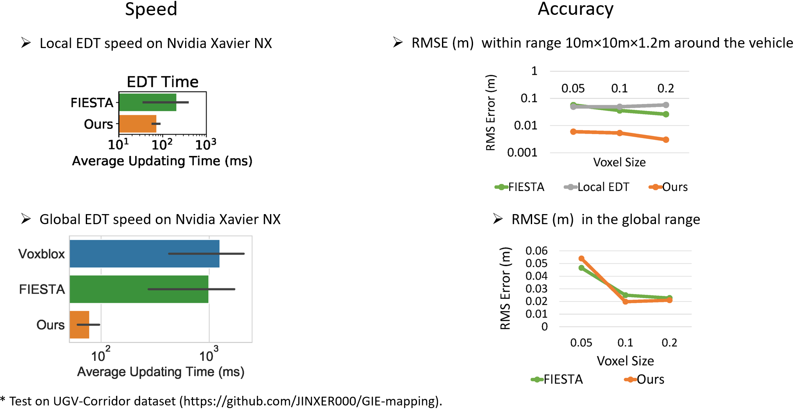

# GIE-mapping
Source code for the paper: GPU-accelerated Incremental Euclidean Distance Transform for Online Motion Planning of Mobile Robots

The supplementary video can be viewed here:

The UAV-pillar dataset can be downloaded [here](https://www.dropbox.com/s/08vjsaqw6c1ppmv/hector_straight.bag?dl=0).

The UGV-Corridor dataset can be downloaded [here](https://drive.google.com/file/d/1COHl_jEaWHl09kPolfXgYs66_YTrb3uH/view?usp=sharing).
We will release the source code upon acceptance of our paper. 

The comparision with other mappers can be found in this figure:
